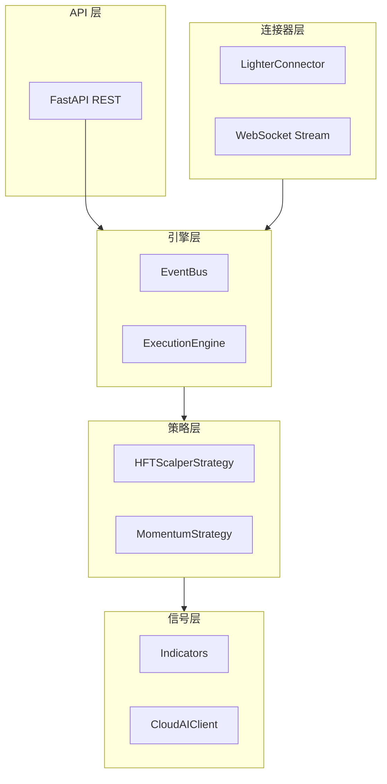

# HFT 架构设计文档

## 分层架构图



---

## 目录结构

```
auto_trade/
├── connectors/           # 交易所适配器
│   ├── base.py           # BaseConnector 抽象类
│   ├── factory.py        # ConnectorFactory
│   ├── retry.py          # 限流/重试/Nonce
│   └── lighter/client.py # Lighter 实现
├── engine/               # 核心引擎
│   ├── event_bus.py      # 事件总线 (Singleton)
│   └── execution_engine.py # 订单执行引擎
├── strategies/           # 策略层
│   ├── base.py           # BaseStrategy 抽象类
│   └── hft_scalper.py    # HFT 剥头皮策略
├── signals/              # 信号生成
│   ├── indicators.py     # 技术指标
│   └── ai_analyzer.py    # AI 分析
├── risk/                 # 风控模块
│   └── position_sizer.py # 仓位计算
├── api/                  # REST API
├── config.py             # 配置
└── main.py               # 入口
```

---

## 设计模式

| 模式 | 应用 |
|------|------|
| **Adapter** | 交易所连接器 (LighterConnector) |
| **Factory** | ConnectorFactory.create() |
| **Singleton** | EventBus 单例 |
| **Observer** | EventBus 事件订阅 |
| **Strategy** | BaseStrategy 策略抽象 |

---

## Global ID 规范

| 类型 | 格式 | 示例 |
|------|------|------|
| 订单 | `ORD_{SIDE}_{TS}` | `ORD_BUY_1704789600` |
| 信号 | `SIG_{ACTION}_{TS}` | `SIG_BUY_1704789600` |
| 事件 | `EVT_{TYPE}_{TS}` | `EVT_PRICE_UPDATE_xxx` |
